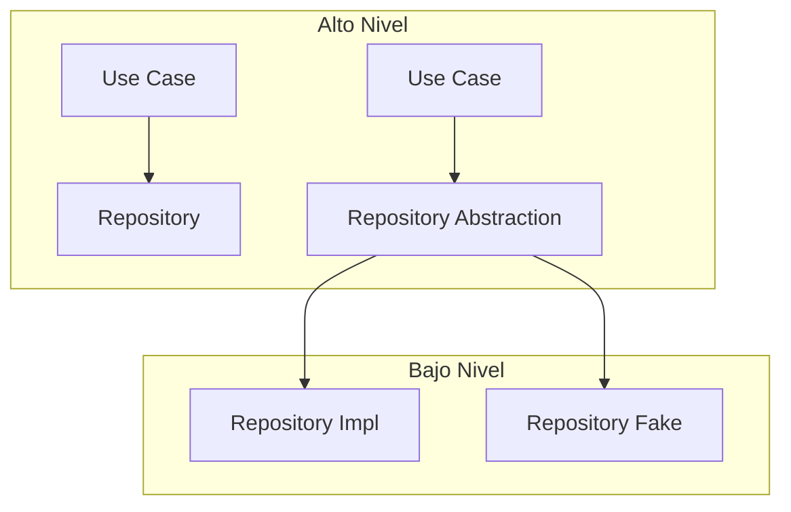

---
# try also 'default' to start simple
theme: 'default'
# https://sli.dev/custom/highlighters.html
highlighter: shiki
fonts:
  # basically the text
  sans: 'Nunito Sans'
  # use with `font-serif` css class from windicss
  serif: 'Roboto Condensed'
  # for code blocks, inline code, etc.
  mono: 'Fira Code'
# show line numbers in code blocks
lineNumbers: false
# some information about the slides, markdown enabled
info: |
  ## Slidev Starter Template
  Presentation slides for developers.

  Learn more at [Sli.dev](https://sli.dev)
# persist drawings in exports and build
drawings:
  persist: false
css: unocss
layout: cover
---

# Clean Architecture

Descubre cómo crear aplicaciones escalables y mantenibles
<div class="uppercase text-sm tracking-widest">
Sebastian Guevara
</div>

<div class="abs-bl mx-14 my-12 flex">
  <div class="ml-3 flex flex-col text-left">
    <div><b>Workshop</b> Space</div>
    <div class="text-sm opacity-50">May. 2th, 2023</div>
  </div>
</div>

<div class="absolute bottom-10 right-10">
  <span class="text-sm">
    <SlideCurrentNo />
  </span>
</div>

---
layout: intro
---

# Sebastian Guevara

<div class="leading-8 opacity-80">
Interesado en el diseño de software, arquitecturas escalables, <br>
sistemas distribuidos, sistemas de transacciones de alta demanda y tecnologías web. <br>
<br>

<span>Si no tienes el control sobre tu aplicación, alguien lo tendrá por tí. </span>

</div>

<div class="my-10 grid grid-cols-[40px,1fr] w-min gap-y-4">
  <div class="flex items-center">
    <svg xmlns="http://www.w3.org/2000/svg" class="opacity-50 block my-auto" width="32" height="32" viewBox="0 0 24 24"><path fill="currentColor" d="M5.884 18.653c-.3-.2-.558-.456-.86-.816a50.59 50.59 0 0 1-.466-.579c-.463-.575-.755-.841-1.056-.95a1 1 0 1 1 .675-1.882c.752.27 1.261.735 1.947 1.588c-.094-.117.34.427.433.539c.19.227.33.365.44.438c.204.137.588.196 1.15.14c.024-.382.094-.753.202-1.096c-2.968-.725-4.648-2.64-4.648-6.396c0-1.238.37-2.355 1.058-3.291c-.218-.894-.185-1.975.302-3.192a1 1 0 0 1 .63-.583c.081-.024.127-.034.208-.047c.803-.123 1.937.17 3.415 1.097a11.731 11.731 0 0 1 2.687-.308c.912 0 1.819.103 2.684.308c1.477-.933 2.614-1.227 3.422-1.097c.085.014.158.032.218.051a1 1 0 0 1 .616.58c.487 1.215.52 2.296.302 3.19c.691.936 1.058 2.045 1.058 3.292c0 3.758-1.674 5.666-4.642 6.393c.125.415.19.878.19 1.38c0 .664-.002 1.299-.007 2.01c0 .19-.002.394-.005.706a1 1 0 0 1-.018 1.957c-1.14.228-1.984-.532-1.984-1.524l.002-.447l.005-.705c.005-.707.008-1.338.008-1.997c0-.697-.184-1.152-.426-1.361c-.661-.57-.326-1.654.541-1.751c2.966-.334 4.336-1.483 4.336-4.66c0-.955-.312-1.745-.913-2.405a1 1 0 0 1-.189-1.044c.166-.415.236-.957.095-1.614l-.01.002c-.491.14-1.11.44-1.858.95a1 1 0 0 1-.833.135a9.626 9.626 0 0 0-2.592-.35c-.89 0-1.772.12-2.592.35a1 1 0 0 1-.829-.133c-.753-.507-1.374-.807-1.87-.947c-.143.653-.072 1.194.093 1.607a1 1 0 0 1-.189 1.044c-.597.656-.913 1.459-.913 2.404c0 3.172 1.371 4.33 4.322 4.66c.865.098 1.202 1.178.545 1.749c-.193.167-.43.732-.43 1.364v3.149c0 .986-.834 1.726-1.96 1.529a1 1 0 0 1-.04-1.963v-.99c-.91.062-1.661-.087-2.254-.484Z"/></svg>
  <div class="ml-2"><a href="https://github.com/SebasG22" target="_blank">SebasG22</a></div>
  </div>
</div>


---
layout: center
class: text-center
---
# Clean Architecture

Un breve resumen

<!-- 
- Con el tiempo vamos descubriendo conceptos nuevos juntos como patrones de diseño, testing, scrum, arquitectura de software etc.
- Lo que intento explicar es que es mucho más difícil y valioso,  tener una buena base de programación que saberse de arriba a abajo un lenguaje, framework o tecnología que esta de moda, porque las modas pasan.

Martin Fowler, dice que todas las arquitecturas caducan pero yo pienso que los frameworks caducan mucho más rápido, sino que se lo digan a la gente de JavaScript.

1. Introduction (5 minutes): Start by introducing yourself and giving a brief overview of what the workshop will cover. -->

----

<blockquote class="relative mb-10">
  <svg class="absolute top-0 left-0 transform -translate-x-6 -translate-y-8 h-16 w-16 text-gray-100 dark:text-gray-700" width="16" height="16" viewBox="0 0 16 16" fill="none" xmlns="http://www.w3.org/2000/svg" aria-hidden="true">
    <path d="M7.39762 10.3C7.39762 11.0733 7.14888 11.7 6.6514 12.18C6.15392 12.6333 5.52552 12.86 4.76621 12.86C3.84979 12.86 3.09047 12.5533 2.48825 11.94C1.91222 11.3266 1.62421 10.4467 1.62421 9.29999C1.62421 8.07332 1.96459 6.87332 2.64535 5.69999C3.35231 4.49999 4.33418 3.55332 5.59098 2.85999L6.4943 4.25999C5.81354 4.73999 5.26369 5.27332 4.84476 5.85999C4.45201 6.44666 4.19017 7.12666 4.05926 7.89999C4.29491 7.79332 4.56983 7.73999 4.88403 7.73999C5.61716 7.73999 6.21938 7.97999 6.69067 8.45999C7.16197 8.93999 7.39762 9.55333 7.39762 10.3ZM14.6242 10.3C14.6242 11.0733 14.3755 11.7 13.878 12.18C13.3805 12.6333 12.7521 12.86 11.9928 12.86C11.0764 12.86 10.3171 12.5533 9.71484 11.94C9.13881 11.3266 8.85079 10.4467 8.85079 9.29999C8.85079 8.07332 9.19117 6.87332 9.87194 5.69999C10.5789 4.49999 11.5608 3.55332 12.8176 2.85999L13.7209 4.25999C13.0401 4.73999 12.4903 5.27332 12.0713 5.85999C11.6786 6.44666 11.4168 7.12666 11.2858 7.89999C11.5215 7.79332 11.7964 7.73999 12.1106 7.73999C12.8437 7.73999 13.446 7.97999 13.9173 8.45999C14.3886 8.93999 14.6242 9.55333 14.6242 10.3Z" fill="currentColor"/></svg>
  <div class="relative z-10">
    <p class="text-gray-800 sm:text-xl dark:text-white"><em>
      Clean architecture son unos principios de diseño de software.
    </em></p>
  </div>
</blockquote>

<blockquote class="relative mb-10">
  <svg class="absolute top-0 left-0 transform -translate-x-6 -translate-y-8 h-16 w-16 text-gray-100 dark:text-gray-700" width="16" height="16" viewBox="0 0 16 16" fill="none" xmlns="http://www.w3.org/2000/svg" aria-hidden="true">
    <path d="M7.39762 10.3C7.39762 11.0733 7.14888 11.7 6.6514 12.18C6.15392 12.6333 5.52552 12.86 4.76621 12.86C3.84979 12.86 3.09047 12.5533 2.48825 11.94C1.91222 11.3266 1.62421 10.4467 1.62421 9.29999C1.62421 8.07332 1.96459 6.87332 2.64535 5.69999C3.35231 4.49999 4.33418 3.55332 5.59098 2.85999L6.4943 4.25999C5.81354 4.73999 5.26369 5.27332 4.84476 5.85999C4.45201 6.44666 4.19017 7.12666 4.05926 7.89999C4.29491 7.79332 4.56983 7.73999 4.88403 7.73999C5.61716 7.73999 6.21938 7.97999 6.69067 8.45999C7.16197 8.93999 7.39762 9.55333 7.39762 10.3ZM14.6242 10.3C14.6242 11.0733 14.3755 11.7 13.878 12.18C13.3805 12.6333 12.7521 12.86 11.9928 12.86C11.0764 12.86 10.3171 12.5533 9.71484 11.94C9.13881 11.3266 8.85079 10.4467 8.85079 9.29999C8.85079 8.07332 9.19117 6.87332 9.87194 5.69999C10.5789 4.49999 11.5608 3.55332 12.8176 2.85999L13.7209 4.25999C13.0401 4.73999 12.4903 5.27332 12.0713 5.85999C11.6786 6.44666 11.4168 7.12666 11.2858 7.89999C11.5215 7.79332 11.7964 7.73999 12.1106 7.73999C12.8437 7.73999 13.446 7.97999 13.9173 8.45999C14.3886 8.93999 14.6242 9.55333 14.6242 10.3Z" fill="currentColor"/>
  </svg>
  <div class="relative z-10 mt-20">
    <p class="text-gray-800 sm:text-xl dark:text-white"><em>
      Esto principios pueden ser aplicados en cualquier tecnología
    </em></p>
  </div>
</blockquote>

<blockquote class="relative mb-10">
  <svg class="absolute top-0 left-0 transform -translate-x-6 -translate-y-8 h-16 w-16 text-gray-100 dark:text-gray-700" width="16" height="16" viewBox="0 0 16 16" fill="none" xmlns="http://www.w3.org/2000/svg" aria-hidden="true">
    <path d="M7.39762 10.3C7.39762 11.0733 7.14888 11.7 6.6514 12.18C6.15392 12.6333 5.52552 12.86 4.76621 12.86C3.84979 12.86 3.09047 12.5533 2.48825 11.94C1.91222 11.3266 1.62421 10.4467 1.62421 9.29999C1.62421 8.07332 1.96459 6.87332 2.64535 5.69999C3.35231 4.49999 4.33418 3.55332 5.59098 2.85999L6.4943 4.25999C5.81354 4.73999 5.26369 5.27332 4.84476 5.85999C4.45201 6.44666 4.19017 7.12666 4.05926 7.89999C4.29491 7.79332 4.56983 7.73999 4.88403 7.73999C5.61716 7.73999 6.21938 7.97999 6.69067 8.45999C7.16197 8.93999 7.39762 9.55333 7.39762 10.3ZM14.6242 10.3C14.6242 11.0733 14.3755 11.7 13.878 12.18C13.3805 12.6333 12.7521 12.86 11.9928 12.86C11.0764 12.86 10.3171 12.5533 9.71484 11.94C9.13881 11.3266 8.85079 10.4467 8.85079 9.29999C8.85079 8.07332 9.19117 6.87332 9.87194 5.69999C10.5789 4.49999 11.5608 3.55332 12.8176 2.85999L13.7209 4.25999C13.0401 4.73999 12.4903 5.27332 12.0713 5.85999C11.6786 6.44666 11.4168 7.12666 11.2858 7.89999C11.5215 7.79332 11.7964 7.73999 12.1106 7.73999C12.8437 7.73999 13.446 7.97999 13.9173 8.45999C14.3886 8.93999 14.6242 9.55333 14.6242 10.3Z" fill="currentColor"/>
  </svg>
  <div class="relative z-10 mt-20">
    <p class="text-gray-800 sm:text-xl dark:text-white"><em>
      Clean architecture puede tener diferentes implementaciones
    </em></p>
  </div>
</blockquote>

<p class="text-gray-800 text-gray-800 md:text-4xl dark:text-white text-center" style="line-height: 3rem"><em>
    Clean Architecture nos ayuda a cumplir los principios SOLID
  </em></p>

<!-- Los principios SOLID son directrices generales para escribir código limpio y evolucionar con el tiempo..

Saber SOLID es una habilidad esencial para cualquier desarrollador que quiera escribir software de alta calidad. -->

---

<div class="flex items-center justify-center">
 
</div>

---

<blockquote class="relative mb-10">
  <svg class="absolute top-0 left-0 transform -translate-x-6 -translate-y-8 h-16 w-16 text-gray-100 dark:text-gray-700" width="16" height="16" viewBox="0 0 16 16" fill="none" xmlns="http://www.w3.org/2000/svg" aria-hidden="true">
    <path d="M7.39762 10.3C7.39762 11.0733 7.14888 11.7 6.6514 12.18C6.15392 12.6333 5.52552 12.86 4.76621 12.86C3.84979 12.86 3.09047 12.5533 2.48825 11.94C1.91222 11.3266 1.62421 10.4467 1.62421 9.29999C1.62421 8.07332 1.96459 6.87332 2.64535 5.69999C3.35231 4.49999 4.33418 3.55332 5.59098 2.85999L6.4943 4.25999C5.81354 4.73999 5.26369 5.27332 4.84476 5.85999C4.45201 6.44666 4.19017 7.12666 4.05926 7.89999C4.29491 7.79332 4.56983 7.73999 4.88403 7.73999C5.61716 7.73999 6.21938 7.97999 6.69067 8.45999C7.16197 8.93999 7.39762 9.55333 7.39762 10.3ZM14.6242 10.3C14.6242 11.0733 14.3755 11.7 13.878 12.18C13.3805 12.6333 12.7521 12.86 11.9928 12.86C11.0764 12.86 10.3171 12.5533 9.71484 11.94C9.13881 11.3266 8.85079 10.4467 8.85079 9.29999C8.85079 8.07332 9.19117 6.87332 9.87194 5.69999C10.5789 4.49999 11.5608 3.55332 12.8176 2.85999L13.7209 4.25999C13.0401 4.73999 12.4903 5.27332 12.0713 5.85999C11.6786 6.44666 11.4168 7.12666 11.2858 7.89999C11.5215 7.79332 11.7964 7.73999 12.1106 7.73999C12.8437 7.73999 13.446 7.97999 13.9173 8.45999C14.3886 8.93999 14.6242 9.55333 14.6242 10.3Z" fill="currentColor"/></svg>
  <div class="relative z-10">
    <p class="text-gray-800 sm:text-xl dark:text-white"><em>
      Una buena arquitectura oculta detalles de implementación
    </em></p>
  </div>
</blockquote>

<blockquote class="relative mb-10">
  <svg class="absolute top-0 left-0 transform -translate-x-6 -translate-y-8 h-16 w-16 text-gray-100 dark:text-gray-700" width="16" height="16" viewBox="0 0 16 16" fill="none" xmlns="http://www.w3.org/2000/svg" aria-hidden="true">
    <path d="M7.39762 10.3C7.39762 11.0733 7.14888 11.7 6.6514 12.18C6.15392 12.6333 5.52552 12.86 4.76621 12.86C3.84979 12.86 3.09047 12.5533 2.48825 11.94C1.91222 11.3266 1.62421 10.4467 1.62421 9.29999C1.62421 8.07332 1.96459 6.87332 2.64535 5.69999C3.35231 4.49999 4.33418 3.55332 5.59098 2.85999L6.4943 4.25999C5.81354 4.73999 5.26369 5.27332 4.84476 5.85999C4.45201 6.44666 4.19017 7.12666 4.05926 7.89999C4.29491 7.79332 4.56983 7.73999 4.88403 7.73999C5.61716 7.73999 6.21938 7.97999 6.69067 8.45999C7.16197 8.93999 7.39762 9.55333 7.39762 10.3ZM14.6242 10.3C14.6242 11.0733 14.3755 11.7 13.878 12.18C13.3805 12.6333 12.7521 12.86 11.9928 12.86C11.0764 12.86 10.3171 12.5533 9.71484 11.94C9.13881 11.3266 8.85079 10.4467 8.85079 9.29999C8.85079 8.07332 9.19117 6.87332 9.87194 5.69999C10.5789 4.49999 11.5608 3.55332 12.8176 2.85999L13.7209 4.25999C13.0401 4.73999 12.4903 5.27332 12.0713 5.85999C11.6786 6.44666 11.4168 7.12666 11.2858 7.89999C11.5215 7.79332 11.7964 7.73999 12.1106 7.73999C12.8437 7.73999 13.446 7.97999 13.9173 8.45999C14.3886 8.93999 14.6242 9.55333 14.6242 10.3Z" fill="currentColor"/></svg>
  <div class="relative z-10">
    <p class="text-gray-800 sm:text-xl dark:text-white"><em>
      Las decisiones que tomamos hoy tienen un impacto directo en el futuro, ya que quizás tengamos que desechar lo que hicimos en algún momento posterior.
    </em></p>
  </div>
</blockquote>

<p class="text-gray-800 text-gray-800 md:text-4xl dark:text-white text-center" style="line-height: 3rem"><em>
    Es común que eliminemos el código que está estrechamente vinculado a bibliotecas, dado que estas últimas pueden evolucionar y cambiar de forma drástica con el tiempo.
  </em></p>

---
layout: two-cols
---

# SOLID

<ul class="mt-10">
<li> Acronimo</li>
<li> Propuesto por Robert C. Martin
en el año 2000 </li>
</ul>

::right::

<p class="text-2xl"><span class="text-5xl font-bold">S</span>ingle responsibility principle </p>
<p class="text-2xl"><span class="text-5xl font-bold">O</span>pen close principle</p>
<p class="text-2xl"><span class="text-5xl font-bold">L</span>ivskov substitution principle</p>
<p class="text-2xl"><span class="text-5xl font-bold">I</span>nterface segregation principle</p>
<p class="text-2xl"><span class="text-5xl font-bold">D</span>ependency inversion principle </p>

---
layout: cover
---
# Single responsibility

Una clase o módulo debe tener una única razón para cambiar
<div class="uppercase text-sm tracking-widest">
Robert C. Martin (Uncle Bob)
</div>

---

# Single responsibility

-  Una única razón para cambiar, es decir, su responsabilidad debe ser única y bien definida.
- Promueve la cohesión y el acoplamiento reducido.
- Facilita el mantenimiento, la escalabilidad y la reutilización del código.

<div class="flex items-center justify-center gap-32 mt-10">
<div>
 
 <span class="text-md flex justify-center font-bold mt-4"> No lo cumple </span>
</div>
<div>
  
 <span class="text-md flex justify-center font-bold mt-4"> Si lo cumple </span>
</div>
</div>

---

# Single responsibility

```ts
function obtenerYAlmacenarUsuarios() {
  const url = 'https://example.com/api/users';

  // Obtiene los datos del servidor
  fetch(url)
    .then(response => response.json())
    .then(data => {
      // Mapea los datos
      const usuarios = data.map(d => ({ nombre: d.name, email: d.email }));

      // Almacena los datos en la caché
      localStorage.setItem('usuarios', JSON.stringify(usuarios));

      // Persiste los datos en la base de datos
      const db = new Database('usuariosDB');
      db.save('usuarios', usuarios);

      // Registra el evento
      console.log('Usuarios obtenidos y almacenados correctamente');
    });
}
```
---

# Single responsibility

```ts
interface Usuario {
  nombre: string;
  email: string;
}

interface DatosServidor {
  name: string;
  email: string;
}

// Función para obtener los datos del servidor
async function obtenerUsuarios(): Promise<DatosServidor[]> {
  const url: string = 'https://example.com/api/users';

  const response = await fetch(url);
  const data = await response.json();

  return data;
}

// Función para mapear los datos
function mapearUsuarios(data: DatosServidor[]): Usuario[] {
  return data.map((d: DatosServidor) => ({ nombre: d.name, email: d.email }));
}

// Función para almacenar los datos en caché
function almacenarUsuariosEnCache(usuarios: Usuario[]): void {
  localStorage.setItem('usuarios', JSON.stringify(usuarios));
}

```

---

# Single responsibility

```ts
// Función para persistir los datos en la base de datos
function persistirUsuariosEnBD(usuarios: Usuario[]): void {
  const db = new Database('usuariosDB');
  db.save('usuarios', usuarios);
}

// Función para registrar el evento
function registrarEvento(mensaje: string): void {
  console.log(mensaje);
}

// Función que coordina todas las responsabilidades anteriores
async function obtenerYAlmacenarUsuarios(): Promise<void> {
  try {
    const data = await obtenerUsuarios();
    const usuarios = mapearUsuarios(data);

    almacenarUsuariosEnCache(usuarios);
    persistirUsuariosEnBD(usuarios);
    registrarEvento('Usuarios obtenidos y almacenados correctamente');
  } catch (error) {
    console.error('Ha ocurrido un error al obtener y almacenar los usuarios:', error);
  }
}
```

---

# Single responsibility

```ts
const [products, setProducts] = useState([]);
  const [filterRate, setFilterRate] = useState(1);

  const fetchProducts = async () => {
    const response = await axios.get(
      "https://fakestoreapi.com/products"
    );
    if (response && response.data) setProducts(response.data);
  };

  useEffect(() => {
    fetchProducts();
  }, []);

  const handleRating = (rate: number) => {
    setFilterRate(rate);
  };

  const filteredProducts = useMemo(
    () => products.filter((product: any) => product.rating.rate > filterRate),
    [products, filterRate]
  );

  return ...
```  

---

# Single responsibility - React

```ts
import axios from "axios";
import { useEffect, useState } from "react";

export const useProducts = () => {
  const [products, setProducts] = useState<any[]>([]);

  const fetchProducts = async () => {
    const response = await axios.get(
      "https://fakestoreapi.com/products"
    );

    if (response && response.data) setProducts(response.data);
  };

  useEffect(() => {
    fetchProducts();
  }, []);

  return { products };
};
```

---

# Single responsibility - React

```ts
import { useState } from "react";

export function useRateFilter() {
  const [filterRate, setFilterRate] = useState(1);

  const handleRating = (rate: number) => {
    setFilterRate(rate);
  };

  return { filterRate, handleRating };
}
```

---

# Single responsibility - React

```ts
export function ProductList() {
  const { products } = useProducts();

  const { filterRate, handleRating } = useRateFilter();

  return (
    <div className="flex flex-col h-full">
      <Filter
        filterRate={filterRate as number}
        handleRating={handleRating}
      />
      <div className="h-full flex flex-wrap justify-center">
        {filterProducts(products, filterRate).map((product: any) => (
          <Product product={product} />
        ))}
      </div>
    </div>
  );
}
```
---
layout: cover
---
# Open Closed

Una clase o módulo deben estar abiertas para la extensión, pero cerradas para la modificación.
<div class="uppercase text-sm tracking-widest">
Bertrand Meyer - Object-Oriented Software Construction" 1988
</div>


---

# Open Closed

```ts
enum ShippingOption { Standard, Express,}

class Order {
  shippingOption: ShippingOption;

  constructor(shippingOption: ShippingOption) {
    this.shippingOption = shippingOption;
  }

  calculateShippingCost(weight: number): number {
    if (this.shippingOption === ShippingOption.Standard) {
      return weight * 0.5;
    } else if (this.shippingOption === ShippingOption.Express) {
      return weight * 1.5;
    } else {
      throw new Error('Invalid shipping option');
    }
  }
}

const order = new Order(ShippingOption.Standard);
const shippingCost = order.calculateShippingCost(10);
console.log(`Shipping cost: $${shippingCost}`);
```

---

# Open Closed

```ts
interface ShippingCalculator {
  calculateShippingCost(weight: number): number;
}

class StandardShippingCalculator implements ShippingCalculator {
  calculateShippingCost(weight: number): number {
    return weight * 0.5;
  }
}

class ExpressShippingCalculator implements ShippingCalculator {
  calculateShippingCost(weight: number): number {
    return weight * 1.5;
  }
}
```

---

# Open Closed

```ts
class Order {
  shippingCalculator: ShippingCalculator;

  constructor(shippingCalculator: ShippingCalculator) {
    this.shippingCalculator = shippingCalculator;
  }

  calculateShippingCost(weight: number): number {
    return this.shippingCalculator.calculateShippingCost(weight);
  }
}

const order = new Order(new StandardShippingCalculator());
const shippingCost = order.calculateShippingCost(10);
console.log(`Shipping cost: $${shippingCost}`);
```
--- 

# Open Closed - React

```ts
const Product = ({ type, onClick }) => {
  let productImage;
  let productName;
  let productDescription;

  if (type === 'shirt') {
    productImage = 'shirt.jpg';
    productName = 'T-Shirt';
    productDescription = 'This is a cool t-shirt!';
  } else if (type === 'shoes') {
    productImage = 'shoes.jpg';
    productName = 'Sneakers';
    productDescription = 'These are awesome sneakers!';
  }

  return (
    <div className="product">
      
      <h2>{productName}</h2>
      <p>{productDescription}</p>
      <button onClick={onClick}>Buy Now</button>
    </div>
  );
};

export default Product;
```

---

# Open Closed - React

```ts
const Product = ({ product, onClick }) => {
  const { name, image, description } = product;

  return (
    <div className="product">
      
      <h2>{name}</h2>
      <p>{description}</p>
      <button onClick={onClick}>Buy Now</button>
    </div>
  );
};

export default Product;
```

---
layout: cover
---
# Liskov Substitution  
 
Una clase o módulos compartiendo abstracción deben poder ser intercambiables
<div class="uppercase text-sm tracking-widest">
Barbara Liskov - Data Abstraction and Hierarchy 1987
</div>

---

# Liskov Substitution

- Las clases derivadas no pueden modificar las capacidades de su clase base.
- Dos clases que heredan de otra tienen que tener las mismas capacidades
- Dos clases que implementan el mismo interface tienen que tener las mismas capacidades.

---

# Liskov Substitution

```ts
class CoffeeMachine {
  makeCoffee() {
    console.log('Making coffee...');
  }
}
class EspressoMachine extends CoffeeMachine {
  makeCoffee() {
    console.log('Making espresso...');
  }
  addMilk() {
    console.log('Adding milk...');
  }
}
function orderCoffee(machine) {
  machine.makeCoffee();
  machine.addMilk();
}

const machine1 = new CoffeeMachine();
const machine2 = new EspressoMachine();

orderCoffee(machine1); // Making coffee... TypeError: machine.addMilk is not a function
orderCoffee(machine2); // Making espresso... Adding milk...
```

---

# Liskov Substitution

```ts
class CoffeeMachine {
  makeCoffee(): void {
    console.log('Making coffee...');
  }
}

class MilkAddingMachine {
  addMilk(): void {
    console.log('Adding milk...');
  }
}

class EspressoMachine extends CoffeeMachine {
  makeCoffee(): void {
    console.log('Making espresso...');
  }
}

```

---

# Liskov Substitution

```ts
class EspressoMilkMachine extends EspressoMachine implements MilkAddingMachine {
  addMilk(): void {
    console.log('Adding milk...');
  }
}

function orderCoffee(machine: CoffeeMachine | EspressoMilkMachine): void {
  machine.makeCoffee();
  if (machine instanceof EspressoMilkMachine) {
    machine.addMilk();
  }
}

const machine1 = new CoffeeMachine();
const machine2 = new EspressoMachine();
const machine3 = new EspressoMilkMachine();

orderCoffee(machine1); // Making coffee...
orderCoffee(machine2); // Making espresso...
orderCoffee(machine3); // Making espresso... Adding milk...

```
---
layout: cover
---
# Interface Segregation 
 
Una clase o módulos compartiendo abstracción deben poder ser intercambiables
<div class="uppercase text-sm tracking-widest">
Barbara Liskov - Data Abstraction and Hierarchy 1987
</div>


---

# Interface Segregation

- Establece que los clientes no deben depender de interfaces que no usan.
- Mejora la cohesión del código.
- Aumenta la escalabilidad y modularidad del software al hacer que los módulos sean más independientes y fáciles de modificar o reutilizar

---

# Interface Segregation

```ts
interface Animal {
  fly(): void;
  swim(): void;
}

class Dog implements Animal {
  swim() {
    console.log('Dog is swimming.');
  }

  fly() {
    throw new Error('Dog cannot fly.');
  }
}
```
---

# Interface Segregation

```ts
interface Swimmable {
  swim(): void;
}

interface Flyable {
  fly(): void;
}

class Dog implements Swimmable {
  swim() {
    console.log('Dog is swimming.');
  }
}
```
---
layout: cover
---
# Dependency Inversion
 
Una clase o módulos de alto nivel no deben depender directamente de los módulos de bajo nivel ambos deberían depender de abstracciones
<div class="uppercase text-sm tracking-widest">
Robert C Martin (Uncle Bob) - Agile Software Development: Principles, Patterns, and Practices 2002
</div>

---

# Dependency Inversion

- Se enfoca en separar la dependencia de las implementaciones concretas.
- Permite que los módulos de alto nivel se comuniquen con los de bajo nivel a través de abstracciones.

- Las abstracciones no deben depender de los detalles, los detalles deben depender de las abstracciones
- Testing fácilmente se puede simular dependencias

<div class="flex items-center justify-center gap-32 mt-10">
<div>
 
 <span class="text-md flex justify-center font-bold mt-4"> Enchufe </span>
</div>
<div>
  
 <span class="text-md flex justify-center font-bold mt-4"> Bluetooth </span>
</div>
</div>

 <!-- Módulos de alto nivel: Estos módulos suelen ser más abstractos y generales, y se enfocan en la funcionalidad principal del sistema. 
 Importante, la abstracción la marca el cliente.
 - Los módulos de alto nivel son aquellos que contienen la lógica de negocio principal del sistema. (negocio, presentación, datos)

- Los módulos de bajo nivel son aquellos que proporcionan servicios específicos y concretos al sistema, como acceso a bases de datos, servicios de red, etc. Estos módulos suelen ser más detallados y especializados. ( detalles de implementación)

Electric Plug: Consider the electric plug used to power electronic devices. The plug is an abstraction that allows any device to be powered by electricity without having to know the specifics of the electrical system. Any device can simply plug into the outlet and receive the power it needs.

Bluetooth Headphones: When using Bluetooth headphones, the headphones and the device they are paired with communicate through a standard Bluetooth protocol. This means that any device with Bluetooth capabilities can connect to the headphones, regardless of the specific model or manufacturer.

 -->

---

# Dependency Inversion

```ts
class UserController {
  private readonly userRepository: UserRepository;

  constructor() {
    this.userRepository = new UserRepository();
  }

  async createUser(user: User): Promise<void> {
    try {
      await this.userRepository.save(user);
    } catch (error) {
      console.error(error);
    }
  }
}
```

---

# Dependency Inversion

```ts
interface IUserRepository {
  save(user: User): Promise<void>;
}

class UserRepository implements IUserRepository {
  async save(user: User): Promise<void> {
    // implementation
  }
}

class UserController {
  private readonly userRepository: IUserRepository;

  constructor(userRepository: IUserRepository) {
    this.userRepository = userRepository;
  }

  async createUser(user: User): Promise<void> {
    try {
      await this.userRepository.save(user);
    } catch (error) {
      console.error(error);
    }
  }
}
```
---

# Dependency Inversion


<style scoped>
.mermaid {
  display: flex;
  justify-content: center;
}
</style>
---
layout: cover
---

# Clean Architecture

Descubre cómo crear aplicaciones escalables y mantenibles
<div class="uppercase text-sm tracking-widest">
Sebastian Guevara
</div>

<div class="abs-bl mx-14 my-12 flex">
  <div class="ml-3 flex flex-col text-left">
    <div><b>Workshop</b> Space</div>
    <div class="text-sm opacity-50">May. 2th, 2023</div>
  </div>
</div>

<div class="absolute bottom-10 right-10">
  <span class="text-sm">
    <SlideCurrentNo />
  </span>
</div>

---

<blockquote class="relative mb-10">
  <svg class="absolute top-0 left-0 transform -translate-x-6 -translate-y-8 h-16 w-16 text-gray-100 dark:text-gray-700" width="16" height="16" viewBox="0 0 16 16" fill="none" xmlns="http://www.w3.org/2000/svg" aria-hidden="true">
    <path d="M7.39762 10.3C7.39762 11.0733 7.14888 11.7 6.6514 12.18C6.15392 12.6333 5.52552 12.86 4.76621 12.86C3.84979 12.86 3.09047 12.5533 2.48825 11.94C1.91222 11.3266 1.62421 10.4467 1.62421 9.29999C1.62421 8.07332 1.96459 6.87332 2.64535 5.69999C3.35231 4.49999 4.33418 3.55332 5.59098 2.85999L6.4943 4.25999C5.81354 4.73999 5.26369 5.27332 4.84476 5.85999C4.45201 6.44666 4.19017 7.12666 4.05926 7.89999C4.29491 7.79332 4.56983 7.73999 4.88403 7.73999C5.61716 7.73999 6.21938 7.97999 6.69067 8.45999C7.16197 8.93999 7.39762 9.55333 7.39762 10.3ZM14.6242 10.3C14.6242 11.0733 14.3755 11.7 13.878 12.18C13.3805 12.6333 12.7521 12.86 11.9928 12.86C11.0764 12.86 10.3171 12.5533 9.71484 11.94C9.13881 11.3266 8.85079 10.4467 8.85079 9.29999C8.85079 8.07332 9.19117 6.87332 9.87194 5.69999C10.5789 4.49999 11.5608 3.55332 12.8176 2.85999L13.7209 4.25999C13.0401 4.73999 12.4903 5.27332 12.0713 5.85999C11.6786 6.44666 11.4168 7.12666 11.2858 7.89999C11.5215 7.79332 11.7964 7.73999 12.1106 7.73999C12.8437 7.73999 13.446 7.97999 13.9173 8.45999C14.3886 8.93999 14.6242 9.55333 14.6242 10.3Z" fill="currentColor"/></svg>
  <div class="relative z-10">
    <p class="text-gray-800 sm:text-xl dark:text-white"><em>
      Clean Architecture nos ayuda a cumplir los principios SOLID
    </em></p>
  </div>
</blockquote>

<blockquote class="relative mb-10">
  <svg class="absolute top-0 left-0 transform -translate-x-6 -translate-y-8 h-16 w-16 text-gray-100 dark:text-gray-700" width="16" height="16" viewBox="0 0 16 16" fill="none" xmlns="http://www.w3.org/2000/svg" aria-hidden="true">
    <path d="M7.39762 10.3C7.39762 11.0733 7.14888 11.7 6.6514 12.18C6.15392 12.6333 5.52552 12.86 4.76621 12.86C3.84979 12.86 3.09047 12.5533 2.48825 11.94C1.91222 11.3266 1.62421 10.4467 1.62421 9.29999C1.62421 8.07332 1.96459 6.87332 2.64535 5.69999C3.35231 4.49999 4.33418 3.55332 5.59098 2.85999L6.4943 4.25999C5.81354 4.73999 5.26369 5.27332 4.84476 5.85999C4.45201 6.44666 4.19017 7.12666 4.05926 7.89999C4.29491 7.79332 4.56983 7.73999 4.88403 7.73999C5.61716 7.73999 6.21938 7.97999 6.69067 8.45999C7.16197 8.93999 7.39762 9.55333 7.39762 10.3ZM14.6242 10.3C14.6242 11.0733 14.3755 11.7 13.878 12.18C13.3805 12.6333 12.7521 12.86 11.9928 12.86C11.0764 12.86 10.3171 12.5533 9.71484 11.94C9.13881 11.3266 8.85079 10.4467 8.85079 9.29999C8.85079 8.07332 9.19117 6.87332 9.87194 5.69999C10.5789 4.49999 11.5608 3.55332 12.8176 2.85999L13.7209 4.25999C13.0401 4.73999 12.4903 5.27332 12.0713 5.85999C11.6786 6.44666 11.4168 7.12666 11.2858 7.89999C11.5215 7.79332 11.7964 7.73999 12.1106 7.73999C12.8437 7.73999 13.446 7.97999 13.9173 8.45999C14.3886 8.93999 14.6242 9.55333 14.6242 10.3Z" fill="currentColor"/></svg>
  <div class="relative z-10">
    <p class="text-gray-800 sm:text-xl dark:text-white"><em>
      Clean architecture son unos principios de diseño de software
    </em></p>
  </div>
</blockquote>

<blockquote class="relative mb-10">
  <svg class="absolute top-0 left-0 transform -translate-x-6 -translate-y-8 h-16 w-16 text-gray-100 dark:text-gray-700" width="16" height="16" viewBox="0 0 16 16" fill="none" xmlns="http://www.w3.org/2000/svg" aria-hidden="true">
    <path d="M7.39762 10.3C7.39762 11.0733 7.14888 11.7 6.6514 12.18C6.15392 12.6333 5.52552 12.86 4.76621 12.86C3.84979 12.86 3.09047 12.5533 2.48825 11.94C1.91222 11.3266 1.62421 10.4467 1.62421 9.29999C1.62421 8.07332 1.96459 6.87332 2.64535 5.69999C3.35231 4.49999 4.33418 3.55332 5.59098 2.85999L6.4943 4.25999C5.81354 4.73999 5.26369 5.27332 4.84476 5.85999C4.45201 6.44666 4.19017 7.12666 4.05926 7.89999C4.29491 7.79332 4.56983 7.73999 4.88403 7.73999C5.61716 7.73999 6.21938 7.97999 6.69067 8.45999C7.16197 8.93999 7.39762 9.55333 7.39762 10.3ZM14.6242 10.3C14.6242 11.0733 14.3755 11.7 13.878 12.18C13.3805 12.6333 12.7521 12.86 11.9928 12.86C11.0764 12.86 10.3171 12.5533 9.71484 11.94C9.13881 11.3266 8.85079 10.4467 8.85079 9.29999C8.85079 8.07332 9.19117 6.87332 9.87194 5.69999C10.5789 4.49999 11.5608 3.55332 12.8176 2.85999L13.7209 4.25999C13.0401 4.73999 12.4903 5.27332 12.0713 5.85999C11.6786 6.44666 11.4168 7.12666 11.2858 7.89999C11.5215 7.79332 11.7964 7.73999 12.1106 7.73999C12.8437 7.73999 13.446 7.97999 13.9173 8.45999C14.3886 8.93999 14.6242 9.55333 14.6242 10.3Z" fill="currentColor"/></svg>
  <div class="relative z-10">
    <p class="text-gray-800 sm:text-xl dark:text-white"><em>
      Esto principios pueden ser aplicados en cualquier tecnología
    </em></p>
  </div>
</blockquote>

<p class="text-gray-800 text-gray-800 md:text-4xl dark:text-white text-center" style="line-height: 3rem"><em>
    Clean architecture puede tener diferentes implementaciones
  </em></p>
---

- Una buena arquitectura oculta detalles de implementación

---     
layout: center
---

<div class="grid grid-cols-2 gap-4">
  <div class="text-center pb-4">
    
    <div class="opacity-50 mb-2 text-sm mt-4">
        Clean Architecture
    </div>
    
  </div>
 <div class="text-center pb-4">
    
    <div class="opacity-50 mb-2 text-sm mt-4">
        Clean Developer
    </div>
    
  </div>
</div>

<!-- Clean Developer: 

Clean architecture es una arquitectura de software que representa los componentes divididos en capas, las capas internas son las más importantes, son el dominio de tu aplicación, tu lógica de negocio y las capas externas son herramientas utilizadas por tu aplicación y de las que no depende tu aplicación sino que las utiliza.

Si pensamos en los conocimientos que un desarrollador va adquiriendo con la experiencia, se pueden dividir en tipos de conocimientos y estos se pueden ver como capas de conocimientos circulares como en Clean Architecture. 
Del mismo modo los círculos internos son más importantes y core de nuestro conocimiento. A medida que avanzamos en las capas hacia el exterior esos conocimientos son menos estables y es fácil que tengamos que sustituirlos por otros con el paso del tiempo. Sin embargo los conocimientos de los círculos internos son más longevos, útiles y sobreviven a lenguajes, tecnologías, frameworks y por qué no, a las modas.

Conocimiento base 
Lenguajes
Tecnologías y plataformas
Frameworks

Al igual que Uncle bob explica en su famoso artículo sobre Clean Architecture, no son solo cuatro círculos, puedes poner los que quieras.
 -->
----

# Arquitecturas Limpias

- Hexagonal Architecture
- Onion Architecture
- Clean Architecture

<!-- Aunque estas arquitecturas varían un poco en sus detalles, son muy similares. Todas tienen el mismo objetivo, que es la separación de responsabilidades. Todas logran esta separación dividiendo el software en capas. Cada una tiene al menos una capa para reglas de negocio y otra para interfaces. -->
---

<h1>Arquitecturas Limpias</h1>
<span class="font-bold text-xl text-gray-400"> Independientes de Framework </span>

<p class="text-sm leading-8 opacity-80">
La arquitectura no depende de la existencia de alguna biblioteca de software cargada de características. Esto le permite utilizar tales frameworks como herramientas, en lugar de tener que ajustar su sistema a sus limitaciones.
</p>

<span class="font-bold text-xl text-gray-400"> Testeables </span>
<p class="text-sm leading-8 opacity-80">
Las reglas de negocio se pueden probar sin la interfaz de usuario, la base de datos, el servidor web u cualquier otro elemento externo.
</p>

<span class="font-bold text-xl text-gray-400"> Independientes de la interfaz de usuario </span>
<p class="text-sm leading-8 opacity-80">
La interfaz de usuario puede cambiar fácilmente sin cambiar el resto del sistema.
</p>

---

<h1>Arquitecturas Limpias</h1>
<span class="font-bold text-xl text-gray-400"> Independientes de la base de datos </span>

<p class="text-sm leading-8 opacity-80">
 Las reglas de negocio no están atadas a la base de datos.
</p>

<span class="font-bold text-xl text-gray-400"> Independientes de cualquier agencia externa </span>

<p class="text-sm leading-8 opacity-80">
 Las reglas de negocio simplemente no saben nada en absoluto sobre el mundo exterior
</p>